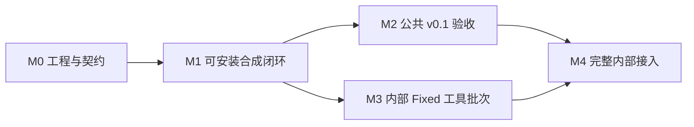

**Agent Runtime v0.1 开发任务拆分**

依据：[集成层设计 v2](C:/codebase/coresmos/agent-runtime-integration-design.md)、[技术选型](C:/codebase/coresmos/agent-runtime-technology-selection.md)。

拆为 15 项公共库任务和 7 项公司内部接入任务。当前仓库只有设计文档，以下任务均为待开发。每项交付包含实现、对应测试和必要的接口说明；依赖沿用技术选型，不另加技术栈。文中的代码路径是计划归属。

**1. 交付阶段**

| 阶段 | 任务范围 | 阶段交付与验收 |
| --- | --- | --- |
| M0：工程与契约 | T01–T02 | 包可构建，公共接口可导入，受控测试组件可使用 |
| M1：首个可安装闭环 | T03–T11 | 安装候选 wheel，通过公开入口和默认装配运行“模型 → 工具 → 文本完成”；关键失败路径随模块交付 |
| M2：公共 v0.1 验收 | T12–T15 | 参考适配器、观测、完整契约套件、制品和接入指南交付；四类合成场景全部通过 |
| M3：内部最小接入 | I01–I03 | Fixed 工具批次完成真实记录、AINA 调用、业务状态处理和终止；可在 M1 后启动，与 M2 并行推进 |
| M4：完整内部接入 | I04–I07 | 完整聊天、业务入口及 SSE 通过真实系统回归，固定版本切换与回滚得到验证 |

M0–M2 使用合成数据，不依赖公司代码或网络。内部基线核对 I01 可以提前开展；内部开发不要求重写公共默认管线。v0.1 范围保持单 Agent、默认顺序工具执行，WAIT 交由宿主接手。

**2. 公共库开发任务**

**T01 工程骨架、依赖与基础检查**

依赖：无。交付：`pyproject.toml`、独立 `uv.lock`、`src/agent_runtime/`、`py.typed`、基础 CI 配置。

- 建立 Python 3.12 基线、src 布局、Hatchling 构建，以及 Ruff、mypy、pytest、pytest-asyncio 配置；运行、可选适配和开发依赖分组。
- 验收：基础 wheel / sdist 能构建并安装；从源码目录外导入成功；未安装 extras 仍可导入基础包；基础检查命令可重复执行。

**T02 公共契约与受控测试组件**

依赖：T01。交付：`contracts.py`、`ports.py`、`testing/` 中的基础替身及接口说明。

- 定义 RunRequest、RunControl、三种执行入口、预算、身份、快照、结果、回执、PendingRef、事件和异常；统一四个核心端口及 ManagedEventStream。
- 明确默认管线需要的低层模型、工具 Invoker、记录器、应用快照、结果政策和摘要投影接口；确定批次多结果的默认控制优先级、普通工具错误政策和部分输出政策，供后续任务共同使用。
- 提供 ScriptedModel、受控工具和事件记录器，支持文本、工具调用、空结果、错误、静默等待及可观察的任务退出；后续任务逐步扩充其故障模式。
- 验收：公共类型不含业务或供应商对象；外部实现无需继承实现类即可满足 Protocol；冻结对象的嵌套集合不存在调用方共享写入；脚本执行次数及关闭状态可断言。

**T03 运行资源作用域、取消与流关闭**

依赖：T02。交付：`lifecycle.py` 及受管事件流支持。

- 实现每次运行独立的任务登记、取消来源、期限、停止等待、显式关闭和有界清理；底层流与任务按创建者归属释放。
- 覆盖等待首个事件、事件间静默、重试退避及工具阻塞；保留用户停止、宿主取消和消费者关闭的原因差异。
- 验收：取消后任务实际退出并被等待，流实际关闭；重复关闭可安全处理；一项清理失败不阻止其他资源释放；两个运行的取消状态互不影响。清理超时不能被报告成释放成功。

**T04 Transcript 契约与 MemoryTranscript**

依赖：T02。交付：`recording.py`、可复用记录器契约用例。

- 实现输入、文本增量 / 最终文本、工具调用及结果的记录，返回真实消息和批次回执；按 RecordTarget 显式读写并发布已提交快照。
- 实现逻辑操作幂等、previous_receipt 核验、消息存在性校验，以及写入失败注入；记录原始事实，摘要投影由上下文模块管理。
- 验收：同一步骤同目标的增量与最终内容正确关联；新步骤 / 新目标隔离；重复提交不重复创建；非法回执及不存在的消息 ID 被拒绝；提交失败不污染已提交历史，目标范围外历史不被自动合并。

**T05 AgentLoop 与步骤完成协议**

依赖：T03。交付：`core.py`、三种入口和协议错误测试。

- 实现 ModelEntry、ToolBatchEntry、CompletedEntry，步骤编号、模型轮次、预算检查及 CONTINUE / FINISH / WAIT 推进；只调用四个核心端口。
- 对模型、工具和文本完成流验证“正常结束时恰好一个完成事件，且为最后一项”；收到完成事件后必须继续确认流正常耗尽。
- 验收：初始工具不占模型轮次；恢复入口继承显式预算；FINISH / WAIT 不额外调用模型；缺失、重复、尾随完成事件以及完成后抛错均中止推进。用受控端口验证，不在核心加入工具名称或业务类型分支。

**T06 能力快照、绑定与 schema 校验**

依赖：T02。交付：`capabilities/`、共用 schema 校验组件。

- 实现 FixedCapabilityProvider、ResolverChain、CapabilitySession 和版本化执行绑定；只有 NoMatch 继续选择链，空能力集合保持为空。
- 使用选定的 jsonschema / referencing 实现 schema 检查与参数校验；发布能力前检查 schema，固定支持的方言，引用仅从内存解析。工具管线复用这一校验组件。
- 验收：Matched 停止选择；Degraded、拒绝和配置错误不被当成 NoMatch；能力变化发布新版本，旧快照不变；缺少引用、非法 schema 和非法参数明确失败；绑定引用不携带可序列化凭据。

**T07 上下文管理与 DefaultStepProvider**

依赖：T04、T06。交付：`context/`、DefaultStepProvider、合成应用快照提供者。

- 实现历史投影、ContextContributor、确定性合并、优先级 / 作用域 / 去重、TokenBudgetPolicy、按完整工具组裁剪，以及可注入估算器和摘要器。
- 提供独立摘要投影的内存实现。每轮读取已提交历史、能力、应用状态和当前记录目标，生成一致的 PreparedStep；版本冲突时重新读取，提交失败后使受影响缓存失效并停止推进。
- 验收：相同输入得到相同上下文；压缩不修改原始记录；工具调用与结果配对；工具 schema 和预留输出计入预算；必需内容超预算或无法估算时明确处理；目标 / 能力变化进入下一轮，快照重读不会重放工具。

**T08 默认模型步骤管线**

依赖：T03、T04。交付：`pipelines/model.py`，接入 ScriptedModel。

- 实现单次有效模型步骤、尝试管理、流式事件与记录、请求级重试和空响应恢复；沿用本次工具快照、tool choice、期限及恢复预算。
- 文本增量和最终提交共享正确身份；部分输出失败按 T02 确定的政策处理；需要压缩或调整上下文时调用上下文接口。
- 验收：空文本且无工具、仅 reasoning 均不产生 ModelCompleted；恢复耗尽明确失败；失败尝试不与新答案拼接；重试不增加模型轮次、不重放工具；取消覆盖 provider 静默和退避，相关任务确实结束。

**T09 默认工具批次管线与结果政策**

依赖：T03、T04、T06。交付：`pipelines/tools.py`、默认 Invoker 和结果政策实现。

- 固定执行“整批校验 → 记录调用 → 顺序执行 → 提交结果及必要状态 → 汇总控制”。校验调用名称、参数、绑定和能力版本，记录成功后才允许第一项外部调用。
- 默认记录全部模型可见调用并保持结果配对；按 T02 的政策处理普通工具失败和控制优先级。结果政策允许按顺序执行多个必要副作用。
- 验收：第二个调用非法也不会让第一个先执行；调用记录失败时工具调用为零；新激活工具不能放行当前批次原本未暴露的调用；结果 / 状态提交失败不进入下一模型步骤；外部成功但提交失败保留调用身份，不能盲目重试。

**T10 默认文本完成管线**

依赖：T04。交付：`pipelines/completion.py`、默认完成政策。

- 先提交最终文本与 reasoning，再执行完成政策；默认 FINISH，政策允许在必要业务状态完成后返回 CONTINUE 或 WAIT。
- 与模型增量记录对齐消息身份；输出唯一 CompletionCompleted，执行中错误或取消不伪造正常完成。
- 验收：文本提交失败时完成副作用调用为零；同一步骤的最终提交不重复创建消息；CONTINUE 只能在状态提交后生效，WAIT 携带有效等待引用。

**T11 RuntimeRunner、默认装配与首个闭环**

依赖：T05、T07、T08、T09、T10。交付：`runner.py`、公共装配入口、首个 `examples/` 场景。

- 创建每次运行独立的记录器、能力实例、上下文和资源作用域；完成输入记录、调用核心、最终化及关闭传播。配置和安全共享服务由装配根持有。
- 从公开 Runtime.run 入口串起默认管线，提供“模型调用普通工具后生成文本”的合成示例，并覆盖三种入口。
- 验收：初始记录失败时模型和工具调用为零；必需最终化失败时不发布成功；CompletedEntry 不调用模型 / 工具但仍完成生命周期；消费者关闭后不继续 yield；安装 wheel 后在源码目录外运行示例，两个并发运行互不污染状态。

**T12 只读观测与 OpenTelemetry 适配**

依赖：T11。交付：`observability.py`、可选 OTel 观察者。

- 提供运行、模型尝试、工具和记录耗时事件及 run / step / call / attempt 关联；采用有界等待或有界队列隔离观察者故障。
- OTel 适配只依赖 API，由宿主提供 SDK 配置；基础包导入不修改全局日志或观测配置。
- 验收：观察者抛错、阻塞或队列满时不重复执行工具、不修改控制结果；观测任务可清理；未安装 otel extra 时默认装配和合成场景仍正常运行。

**T13 真实模型协议参考适配器**

依赖：T08。交付：`adapters/openai.py`、适配器测试及独立 smoke test 示例。

- 实现选定 SDK 的异步 Chat Completions 参考路径，将文本、工具参数分片、结束原因和 usage 归一化；供应商对象止于适配边界。
- 设置明确超时和客户端所有权，关闭 SDK 内建重试，统一由模型管线管理恢复预算；将可选依赖导入隔离在适配器中。
- 验收：本地受控响应覆盖正常文本、工具参数组装、空流、协议异常、超时和中途断流；运行关闭释放该次流且不误关共享客户端；有凭据的真实 smoke test 可单独执行，不成为基础 CI 的前置条件。

**T14 公共契约 Harness 与跨模块故障验证**

依赖：T11、T12、T13。交付：`testing/` 中的可复用契约 Harness、完整故障测试及四类合成场景。

- 整理各模块已经交付的测试支持，允许通过工厂绑定参考实现或公司内部适配器；测试验证行为，不要求继承具体类。公共 testing 支持不强制导入 pytest，测试运行器只作为开发依赖。
- 补齐能力 / 上下文更新、目标切换、终止 / 等待、部分提交失败、预算耗尽、观察者失败和并发状态隔离等组合场景。切换记录器、压缩器和观察者时不修改 AgentLoop。
- 验收：第 5 节中的契约矩阵全部通过；测试保留真实待验证适配器和屏障，只替换可控外部依赖；取消测试观察任务实际退出；调用次数断言同时证明场景进入目标阶段，避免提前失败造成假通过。

**T15 制品、兼容矩阵与接入文档**

依赖：T14。交付：固定版本 wheel / sdist、锁定参考环境、版本说明、`docs/adapter-guide.md` 和最终 CI 配置。

- 检查基础安装、openai、otel 及二者组合；验证依赖下界和锁定组合，按结果确认兼容范围。构建工具及隔离构建依赖也固定版本。
- 执行计划中的 Linux Python 3.12 / 3.13 / 3.14、Windows Python 3.12 验证；从源码目录外执行已安装包，检查 py.typed、示例及契约支持可用。
- 接入指南逐项说明低层适配接口、参考实现、运行资源所有权、调用 / 结果屏障、错误与取消语义、契约套件用法；升级说明记录公共 API 变化。
- 验收：四类合成场景通过已安装制品和默认装配运行；无公司模块及网络依赖；制品版本、来源、哈希和验证结果可追溯。交付到约定渠道，公开发布另行决定。

**3. 公司内部接入任务**

以下任务在公司内部仓库执行。允许访问的服务和测试数据范围由 I01 明确；公共参考实现用于理解契约，业务代码保留在内部。各适配器先运行对应模块用例，T14 完成后接入同一套公共 Harness。

**I01 稳定基线与接口映射**

依赖：无，可提前开展。交付：实际稳定提交、环境锁定信息、接口 / 业务行为映射和内部回归清单。

- 核对实际模型网关、工具目录、鉴权、数据库、业务状态、运行管理和 SSE 接口；记录各适配任务允许访问的服务和测试环境。
- 列明需要保留的 retry 输入 / file_ids、消息目标关系、Widget 事件顺序、停止 / 断开及旧 checkpoint 行为；必要缺陷修复单独列出并验证。
- 验收：所选基线有实际验证依据；每个公共接口都有对应内部服务或明确待补实现，不把相近参考仓库或 R1–R9 当作已验证基线。

**I02 数据库记录与应用状态适配**

依赖：I01、T04。交付：内部 TranscriptPort、RecordTarget 映射、应用快照与状态提交实现。

- 参考 MemoryTranscript 及记录器用例，连接内部消息 / 会话数据库和应用状态服务，保留软删除、元数据、运行终态和目标范围规则。
- 实现真实提交回执、幂等身份和提交后发布快照；必要的状态变更通过所属服务完成，跨模块失败时停止推进并使缓存失效。
- 验收：真实测试数据库覆盖不存在 ID、重复提交、目标变化和事务失败；不得通过 mock 掉记录函数使屏障测试通过；连接池可共享，但并发运行不共享可变数据库会话。

**I03 真实工具与结果政策：首个 Fixed 批次**

依赖：I02、T09、T11。交付：内部 Invoker、工具结果 / 文本完成政策，以及 Fixed + ToolBatchEntry 接入路径。

- 参考默认工具和完成管线，接入获准的 AINA / 脚本执行、权限验证和业务结果处理服务；映射 Session、Canvas、confirmation 和继续规则。
- 首条路径只执行“记录调用 → 真实工具 → 必要业务状态 → 终止”，并提供获准执行调用和明确的入口身份。
- 验收：记录失败时真实外部调用为零；工具执行成功后数据库失败不会触发重复执行；业务状态更新完成才返回 FlowDecision；批次终止后没有额外模型调用。

**I04 业务能力与上下文适配**

依赖：I02、T06、T07。交付：内部 CapabilityProvider、ContextContributor 和应用视图适配。

- 接入工具 / App / Skill 目录、权限和路由，映射 external_status、工具作用域及执行绑定；接入获准的 AAP、Widget/View、文件和记忆来源。
- 复用公共能力会话、上下文预算与压缩流程，明确业务内容的优先级、缓存作用域及 schema 方言转换。
- 验收：拒绝和降级语义不丢失；无权限或未暴露的工具不可执行；新能力仅影响下一轮；目标变更后上下文范围正确；schema 差异用例和跨运行隔离通过。

**I05 公司模型网关适配**

依赖：I01、T08。交付：内部低层模型适配器、企业配置与恢复政策映射。

- 参考 ScriptedModel 和默认模型管线，包装现有单次推理能力；保留获准供应商的 tool choice、reasoning、usage 及特殊响应归一化行为。
- 核对现有客户端 / 网关的重试和回退，确定唯一恢复负责层并计入请求预算；处理每次运行的模型、凭据和客户端资源归属。
- 验收：真实待验证适配器接入受控网关响应后通过模型契约；空结果恢复保持工具及预算；部分输出失败、静默停止、供应商异常和模型隔离行为正确。

**I06 业务入口、默认装配与 SSE 投影**

依赖：I03、I04、I05。交付：普通聊天、retry、pending、Widget 入口及 SSE 适配。

- 在入口完成身份与权限校验、审批结果转换、原始输入 / file_ids 恢复、RecordTarget 和已消耗预算映射，再构造通用 RunRequest。
- 将内部低层适配器接到公共默认装配。宿主后台任务消费 Runtime 流，SSE 只订阅事件投影；保留前端消息 ID 与业务事件顺序。
- 验收：断开 SSE 后符合原业务约定的运行继续，主动停止实际取消；慢订阅者和断开不会造成无限事件积压；SSE 不写数据库或决定循环；旧 checkpoint 按明确的旧入口或经过验证的恢复映射处理。

**I07 内部验收、切换与回滚**

依赖：I06、T15。交付：固定版本接入记录、内部契约 / 业务回归报告、切换开关及回滚记录。

- 使用公司实际版本矩阵运行公共契约 Harness、真实数据库 / 工具集成测试和前端回归，检查消息、权限、状态与副作用。
- 按新运行选择旧或新实现，并固定该次运行使用的版本；记录监控、故障定位和后续运行回滚方式。
- 验收：不对同一笔真实写操作做新旧双执行；回滚不改写正在运行的版本、不宣称撤销既有副作用；外部库完成、内部适配完成和生产切换完成分别有证据。

**4. 建议执行顺序**

| 顺序 | 可开展的任务 | 进入条件 |
| --- | --- | --- |
| 1 | T01；内部同步准备 I01 | 确认工作范围即可 |
| 2 | T02 | 工程骨架可检查、可构建 |
| 3 | T03、T04、T06 | 公共契约和基础测试替身可用 |
| 4 | T05、T07、T08、T09、T10 | 按各任务列出的直接依赖分别进入，具备条件的模块可独立开发 |
| 5 | T11；T08 完成后可开展 T13 | 默认管线及核心就绪后组装首个闭环 |
| 6 | T12、T13；内部推进 I02–I06 | 公共模块按依赖完成；内部先完成 I03 最小工具链路 |
| 7 | T14 → T15 | 模块测试已通过，补齐跨模块故障并验收制品 |
| 8 | I07 | 公共固定制品与完整内部适配都已就绪 |

T03、T04、T06 可以在契约明确后分别实现；共享契约的修改集中回到 T02 的权威定义。每项实现时同步完成该项测试，T14 汇总并补齐组合故障，不承接前面遗漏的基础测试。

**5. 验收场景与责任任务**

| 场景 | 主要责任任务 | 验收断言 |
| --- | --- | --- |
| 正常文本完成 | T08、T10、T11 | 有效消息回执、最终文本和成功终态；没有重复消息 |
| 工具后继续生成文本 | T05、T09、T11 | 调用、结果和必要状态提交后才开始下一模型请求 |
| 工具更新上下文 / 能力 | T06、T07、T09 | 当前批次固定旧快照，下一请求使用新快照 |
| 工具改变目标并终止 | T04、T07、T09 | 消息关联符合目标政策，终止后不调用模型 |
| 记录或状态提交失败 | T04、T09、T10、T11 | 屏障前失败无外部执行；副作用后失败不重放、不发布成功 |
| WAIT 与恢复入口预算 | T02、T05、T11 | 有等待引用及已完成调用信息；初始工具不占模型轮次，旧预算显式传入 |
| 空响应恢复 | T08、T13 | tools、tool choice、预算保持；仅 reasoning 不算有效结果；请求重试不增加模型轮次 |
| 完成协议错误 | T05、T08、T09、T10 | 缺失、重复、尾随完成均被拒绝，不继续执行 |
| 无 token 停止、退避停止、流提前关闭 | T03、T08、T09、T11、T13 | 任务确实退出，资源确实释放，已关闭消费者不再收到事件 |
| 运行隔离与观测失败 | T06、T11、T12 | 模型、目标、能力和回调不串扰；观测失败不重放操作 |
| 安装组合与无内部依赖运行 | T01、T14、T15 | 基础及各 extra 组合可安装；四类合成场景由公开入口运行 |
| 真实业务与前端回归 | I02–I07 | retry、file_ids、Session / Widget 顺序、权限、停止 / 断开和回滚行为正确 |

T14 将前 11 类场景固化为可重复的公共验收套件；最后一类在公司内部验证。每个完成的任务提交实现文件、执行的检查及结果、接口变化和剩余限制，文档描述不替代测试证据。
