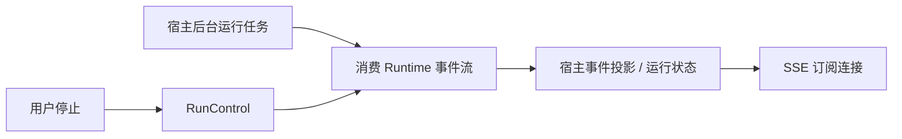

**Agent Runtime 技术选型：独立通用库 v0.1 与公司内部适配**

日期：2026-09-17。依据：[Agent Runtime 集成层设计 v2](C:/codebase/coresmos/agent-runtime-integration-design.md)。

本文给出建议采用的技术栈、取舍和验证条件。Unibot 仅作为相近项目的依赖及接入形态参考，不能据此认定公司实际版本、实现和行为完全相同。本次是文档选型，未安装候选依赖、实现 Runtime 或执行集成测试。

**1. 选型结论**

建议采用 **Python 3.12 + asyncio + 自有四端口状态机**，交付一个可安装的进程内 Python 库。默认管线、内存记录器和合成场景随包交付；公司通过适配器接入现有模型、工具、数据库和 SSE。

核心循环自己实现，JSON Schema 校验、模型通信和观测标准使用成熟库。判断依据是原设计要求精确控制记录屏障、状态提交、步骤完成和取消关闭，而且 v0.1 的流程限定为单 Agent、顺序工具执行。

| 层次 / 能力 | 建议选择 | 依赖归属 | 主要理由 |
| --- | --- | --- | --- |
| 语言与运行时 | CPython 3.12 起步，原生 async/await | 基础环境 | 与参考宿主一致，避免语言桥接和额外服务部署 |
| 执行编排 | 自有 AgentLoop、Runner 和默认管线 | 公共库 | 保留四端口、唯一循环所有者及固定阶段顺序 |
| 公共契约 | dataclass、Enum、typing.Protocol | 标准库 | 类型中立，宿主实现无需继承框架基类 |
| 并发与关闭 | asyncio、contextlib | 标准库 | 统一取消、期限、任务等待和流关闭 |
| 工具参数校验 | jsonschema + referencing | 基础包直接依赖 | 校验动态 JSON Schema，并显式控制引用解析 |
| 真实模型参考适配器 | OpenAI Python SDK 的异步客户端 | 可选 `openai` extra | 提供一种可实测的模型协议接入，隔离供应商类型 |
| 公司模型接入 | 适配现有模型网关 / LangChain 模型客户端 | 公司内部 | 保留已有供应商兼容能力，复用单次推理能力 |
| 上下文与能力 | 自有小型组件，估算器和摘要器可注入 | 公共库 | 与快照、工具配对和预算契约紧密相关 |
| 记录 | MemoryTranscript；内部使用现有数据库适配器 | 公共参考实现 / 公司内部 | 同一行为契约，分别验证内存与真实提交语义 |
| HTTP 与 SSE | 沿用宿主 FastAPI / StreamingResponse | 公司内部 | 网络连接和产品事件由宿主管理 |
| 观测 | 标准 logging；OpenTelemetry API 适配 | 标准库 / 可选 `otel` extra | 库输出中立观测，宿主配置 SDK 和 exporter |
| 工程工具 | uv、Hatchling、pytest、pytest-asyncio、Ruff、mypy | 开发及构建环境 | 与参考项目接近，支持锁定环境、类型检查和异步契约测试 |

基础包直接依赖 jsonschema 和 referencing；模型与观测适配器通过可选 extra 安装。开发、测试和构建工具与运行依赖分开管理，传递依赖由包管理器解析。

**2. 本次使用的依赖与适用范围**

依赖及工具版本参考 [backend/pyproject.toml](C:/codebase/Unibot/backend/pyproject.toml) 和 [backend/uv.lock](C:/codebase/Unibot/backend/uv.lock)。下表只列本次 Runtime v0.1 实际选用的运行环境、直接依赖和开发工具。版本范围为初始建议，待实现时验证并锁定。

| 类型 | 依赖 / 工具 | 版本建议 | 用途 |
| --- | --- | --- | --- |
| 运行环境 | Python | `>=3.12`，首个接入基线为 3.12 | Runtime 执行环境 |
| 基础运行 | jsonschema | `>=4.26,<5` | 工具参数的 JSON Schema 校验 |
| 基础运行 | referencing | `>=0.37,<0.38` | 内存中的 schema 引用解析 |
| 模型适配，可选安装 | openai | `>=2.45,<3` | 参考模型适配器的异步调用与流式响应 |
| 观测适配，可选安装 | opentelemetry-api | `>=1.43,<2` | 运行、模型步骤和工具调用的观测接口 |
| 构建 | hatchling | `>=1.27,<2` | 构建 wheel 和 sdist |
| 测试 | pytest | `>=9.0.3,<10` | 单元测试与契约测试 |
| 测试 | pytest-asyncio | `>=1.4,<2` | 异步执行、取消和关闭测试 |
| 测试 | pytest-cov | `>=7.1,<8` | 测试覆盖率统计 |
| 开发 | ruff | `>=0.15.16,<0.16` | 代码检查与格式化 |
| 开发 | mypy | `>=2.1,<3` | 静态类型检查 |
| 项目工具 | uv | `0.8.22` 起步，固定工具版本 | 环境、依赖和锁文件管理 |

另外核对了以下接入事实，作为兼容性测试的依据，不作为外部实现的代码来源：

- [core/llm.py](C:/codebase/Unibot/backend/src/tianzhou_agent_platform/core/llm.py) 使用 `ChatOpenAI`，设置 `max_retries=0`，并包含指定工具调用、流式响应与供应商差异处理。内部适配不能仅替换一个 SDK 调用就认定等价。
- [core/agent.py](C:/codebase/Unibot/backend/src/tianzhou_agent_platform/core/agent.py) 使用 LangGraph；[store/checkpoint.py](C:/codebase/Unibot/backend/src/tianzhou_agent_platform/store/checkpoint.py) 接入 checkpoint。旧检查点不自动成为新 Runtime 的恢复状态。
- [api/chat.py](C:/codebase/Unibot/backend/src/tianzhou_agent_platform/api/chat.py) 将后台执行任务与 SSE 消费分开；[README](C:/codebase/Unibot/README.md) 明确说明断开连接后继续运行。迁移时必须保留所选业务入口的连接语义。
- [core/schema.py](C:/codebase/Unibot/backend/src/tianzhou_agent_platform/core/schema.py) 有自定义 schema 校验；不能假设它与标准 JSON Schema 的接受范围和错误行为一致。
- [store/database/mysql.py](C:/codebase/Unibot/backend/src/tianzhou_agent_platform/store/database/mysql.py) 使用 SQLAlchemy 异步接口和 MySQL。以实际依赖和实现为参考，不采用 README 目录注释中孤立的数据库描述。

前端工程继续由宿主管理。Runtime v0.1 不引入前端工程；已有前端用于消息 ID、SSE、停止、重试和 Widget 行为的接入回归。

**3. 编排框架：采用自有状态机**

AgentLoop 只处理准备、模型、工具、文本完成及控制结果，默认管线实现各阶段的通用行为。四个端口和独立记录接口保持原设计，不增加通用插件总线或可任意修改运行状态的中间件。

| 备选方案 | 本次决定 | 取舍 |
| --- | --- | --- |
| 自有小型 asyncio 状态机 | 采用 | 执行顺序直接对应契约；需要自行承担协议、取消和故障测试 |
| LangGraph 作为核心 | v0.1 不采用 | 持久化执行和图编排有价值，但当前范围尚不需要这些能力；仍需额外实现本项目的记录与完成协议 |
| LangChain 的 Agent 执行器 | 不作为核心 | 公司可以沿用模型客户端，但循环和工具调度统一交给新 Runtime |
| AnyIO / Trio 作为公共执行底座 | v0.1 不采用 | 首批宿主使用 asyncio；支持多个异步后端会扩大生命周期测试范围 |
| 独立 Runtime 微服务 | v0.1 不采用 | 增加网络边界、事件序列化及部署成本，偏离可安装进程内库的首个交付目标 |

LangGraph 官方定位包含持久化执行、流式输出、人工参与和状态化编排；这些能力并非不适用，而是超出当前 v0.1 的主要范围。选择自有状态机是基于本设计范围的判断，不代表图框架无法实现相同约束。[LangGraph 官方说明](https://docs.langchain.com/oss/python/langgraph/overview)。

以后若明确要求长时间工作流、跨进程恢复或多 Agent 图编排，可以在宿主层使用相应框架，或单独设计持久化扩展。不能通过直接序列化当前 Python 对象，把 v0.1 的 WAIT 宣称为可靠检查点。

**4. 异步、事件流与资源生命周期**

采用标准库 asyncio 和 contextlib。Python 已提供任务取消、TaskGroup 和期限控制；取消请求仍需要协程配合，取消后必须等待清理完成。[Python 3.12 asyncio 文档](https://docs.python.org/3.12/library/asyncio-task.html)。

| 问题 | 实现选择 | 必须守住的语义 |
| --- | --- | --- |
| 流式执行 | 异步迭代器实现 ManagedEventStream，显式提供 `aclose()` | 消费者提前退出时能够逐层关闭底层流 |
| 任务所有权 | 每次运行拥有自己的资源作用域，保留任务引用 | 创建者负责取消并等待，不能只清空引用 |
| 停止与期限 | `asyncio.Event`、任务取消、单调时钟期限和 `asyncio.timeout` | 覆盖无事件等待、退避、工具等待及阶段边界 |
| 并发任务 | 在生命周期封闭的协程内使用 TaskGroup；其他任务显式登记与回收 | TaskGroup 本身不会因正常退出自动取消仍在等待的任务 |
| 清理 | `try/finally`、AsyncExitStack、显式关闭 | 各项清理独立保护，某项记录失败不跳过后续资源释放 |
| 工具批次 | 顺序执行 | 整批校验、调用记录屏障和结果提交顺序固定 |
| 必需事件 | 顺序消费，必要时使用有界队列传递 | 不能按 best-effort 丢弃调用、结果或完成事件 |
| 可选观测 | 有界等待或独立有界队列 | 观测阻塞、异常和队列满不改变业务执行结果 |

核心不创建或接管全局事件循环，不在库内部调用 `asyncio.run()`。RunControl 显式传入，业务状态不放到全局变量或 ContextVar；ContextVar 如有使用，仅用于观测关联。

步骤完成事件必须恰好一个且位于最后。收到完成事件后继续消费并确认正常耗尽，再推进下一阶段；重复完成、尾随事件、耗尽前失败均不能当作成功。关闭了外部消费者之后，清理路径不再尝试 yield 终态。

异步生成器跨 yield 的关闭顺序需要专门验证，不把一个 TaskGroup 横跨任意消费者生命周期当作自动清理方案。需要保护的最终化只允许有界等待；清理超时须暴露未完成状态，不能声称资源已经释放。同步工具转线程也不意味着底层工作可强制终止，不可立即取消的工作由宿主继续追踪。

**5. 公共类型与工具参数校验**

公共请求、事件、回执、快照使用 dataclass、Enum 和 Protocol。接口采用结构化类型约束，测试适配器是否满足行为，不要求继承某个实现基类。[mypy Protocol 文档](https://mypy.readthedocs.io/en/stable/protocols.html)。

采用这一组合的代价是：dataclass 不负责运行时输入校验，类型注解也不保证深层不可变。处理规则如下：

- 契约对象采用 `frozen=True`；集合优先使用 tuple。嵌套 JSON 在边界取得受控副本，禁止共享调用方可变引用；仅声明 Mapping 类型不视为已经保护内部容器。
- 业务 DTO、数据库 ORM 对象、LangChain 消息和 SDK 响应在适配层转换，不能出现在公共签名里。
- 公共入口及结果接收处显式验证身份、预算和结构性约束；公司已有 Pydantic 2 DTO 可继续承担 HTTP 边界校验。涉及调用参数的转换策略应显式规定，避免默认类型转换改变原意。[Pydantic strict mode 文档](https://pydantic.dev/docs/validation/latest/concepts/strict_mode/)。
- 全包使用一套权威事件和枚举定义，提供 `py.typed`。传输层需要 JSON 时做显式投影，不把 SDK 的序列化形式当作公共协议。

**工具 schema 选择 jsonschema，引用解析选择 referencing，均声明为基础包直接依赖。** 原因是 ToolSpec 接收动态 JSON Schema，Pydantic DTO 校验与这项需求不同；自己实现一套 schema 子集会增加标准语义和兼容性维护工作。

默认支持 Draft 2020-12：无 `$schema` 时按此解释，其他方言须在接入边界显式转换或拒绝。能力发布前检查 schema，批次执行前按该能力版本校验全部调用。任何一项校验失败，整批不触发外部调用；错误如何呈现给业务或模型由显式政策决定。[jsonschema 校验接口](https://python-jsonschema.readthedocs.io/en/stable/validate/)。

引用解析使用显式的内存 Registry，不设置网络或文件检索器，缺少引用即失败。这样合成场景的执行不因工具 schema 隐式访问外部资源。由于代码需要直接使用 referencing API，即使 jsonschema 间接依赖它，也应直接声明。[引用解析文档](https://python-jsonschema.readthedocs.io/en/stable/referencing/)。

`format` 在默认策略中作为注解，不宣称已经验证邮箱、日期等所有格式。业务需要强制格式检查时显式提供检查器并验证其依赖。JSON Schema 合法、供应商接受该 schema、当前用户有权执行，是三个分别验证的条件；适配器不能为了通过供应商请求而静默删掉参数限制。

**6. 模型适配与恢复策略**

公共 v0.1 交付 ScriptedModel 和一个基于 OpenAI Python SDK 的可选参考适配器。第一条真实协议路径选择 Chat Completions 的文本与函数调用流，便于验证与参考宿主接近的接入形态。SDK 提供异步客户端与流式接口；这不代表所有“OpenAI 兼容”网关都具有相同能力。[OpenAI Python SDK 官方文档](https://developers.openai.com/api/reference/python)。

此处选择的是参考协议与客户端，不指定业务使用哪个供应商或模型。Responses 等其他协议以后通过模型适配器扩展，不改变核心循环。内部优先包装现有单次模型推理能力；公共库不调用旧 orchestrator。

| 行为 | v0.1 决定 |
| --- | --- |
| SDK 类型 | 在参考适配器内归一化为 ModelStepEvent / ModelResult |
| 尝试与轮次 | 模型轮次与请求尝试分开计数；每次请求尝试仍消耗其请求预算和期限 |
| 重试所有者 | 默认模型管线负责；参考 SDK 设置 `max_retries=0`，避免双层重试 |
| 内部已有恢复 | 核对网关 / LangChain 包装层是否还有重试或回退，指定唯一负责层并纳入预算 |
| 空响应 | 无最终文本且无工具调用不算完成；仅 reasoning 也不算完成 |
| 部分输出后失败 | 默认保留可识别的未完成输出并结束该次失败，不自动拼接下一尝试；支持覆盖时再显式启用恢复政策 |
| 工具调用 | 流内参数先组装、完成后解析；协议和快照校验通过后交给工具端口 |
| usage | 供应商返回量与估算量分别标识，缺失时不能把估算冒充实测 |
| 客户端生命周期 | 共享客户端由宿主 / 装配根关闭；本次运行创建的流由该运行关闭 |

SDK 的 `max_retries` 可以关闭内建重试；超时、取消和流关闭还需针对锁定版本执行测试，不能只依赖默认参数。[OpenAI Python SDK 重试说明](https://developers.openai.com/api/reference/python#retries)。

Unibot 锁中的 OpenAI `2.45.0` 依赖 HTTPX `0.28.1`；本次官方文档已包含 HTTPX2 迁移说明。因此参考实现先验证锁定的候选组合，不把当前文档里的新传输配置直接套到旧 SDK。SDK 升级必须覆盖流关闭、超时、重试和 HTTP mock 的回归。

不另行引入通用重试框架包。第一版恢复政策很窄，用显式循环表达尝试、退避和取消即可；工具重试与模型恢复分离，已发生外部副作用的工具不得被模型请求重试重新执行。

**7. 能力、上下文和 token 预算**

采用原设计的 FixedCapabilityProvider、ResolverChain、CapabilitySession、ContextManager 和 DefaultStepProvider，普通构造函数注入依赖。第一版不增加依赖注入容器、插件扫描系统或额外图框架。

| 能力 | 默认选择 | 扩展位置 |
| --- | --- | --- |
| 能力选择 | 仅 NoMatch 继续责任链，Matched 结束 | 公司目录、权限与路由提供者 |
| 快照 | 每轮固定历史、能力、应用状态和记录目标版本 | 公司应用状态所有者 |
| 上下文贡献 | 按明确优先级、作用域和去重键确定性合并 | 文件、记忆、业务提示词贡献者 |
| 默认压缩 | 按完整工具调用组确定性裁剪 | 可替换摘要器及独立摘要投影存储 |
| token 预算 | 可注入估算器；默认提供公开说明算法及余量的文本估算 | 对应模型的 tokenizer / 宿主计数器 |

暂不强制安装 tiktoken。参考宿主锁中虽然有它，也不能据此认定所有业务模型都使用相同 tokenizer。默认估算用于调度和裁剪，包含工具 schema 与预留输出预算；遇到无法估计的内容类型要求宿主提供估算器或明确拒绝，不能按零 token 放行。

估算不是供应商接受请求的保证。上下文超限需要压缩或改模型时回到上下文模块，底层模型客户端不私自删历史。裁剪保留调用 / 结果配对；必需内容已超过预算时明确失败。原始已提交记录保持完整，压缩摘要属于可替换的模型视图。

同一批次始终使用模型决策时的能力快照；新激活工具只影响下一轮。准备阶段发现版本冲突时重新读取快照，不能借此重放已经执行的工具。

**8. 记录、存储与 SSE 的接入选择**

公共包交付 MemoryTranscript，不自带 SQLAlchemy、数据库 schema 或数据库迁移。内部可优先沿用 SQLAlchemy 2 异步接口及 aiomysql；实际公司数据库不同，只需替换记录适配器。

记录器的验收标准是提交行为：调用记录成功才执行工具；结果和必要状态成功提交才请求下一轮；关键最终化完成才发布成功终态。内存记录器也必须拒绝更新不存在的消息、核验 previous_receipt，并按运行、步骤、目标和逻辑操作身份支持幂等提交。

数据库适配器使用短事务提交相关记录，数据库提交成功后才发布已提交视图。连接池可共享，不能跨并发任务共用同一个 AsyncSession；SQLAlchemy 官方也要求并发任务使用独立会话。[SQLAlchemy asyncio 文档](https://docs.sqlalchemy.org/en/20/orm/extensions/asyncio.html#using-asyncsession-with-concurrent-tasks)。

不持有数据库事务等待长时间模型或外部工具调用。工具成功后本地提交失败时保留调用身份、停止推进，由宿主依据幂等键或核对机制处理；引入数据库并不会获得跨外部系统的 exactly-once。

传输层保留 FastAPI + StreamingResponse，将中立事件映射为现有 SSE 协议。SSE 编码器不写数据库，不调用下一步，不决定 CONTINUE / FINISH / WAIT。

对于 Unibot 这类“断开后继续运行”的入口，结构应为：



宿主后台任务是 Runtime 的消费者，SSE 连接是投影的订阅者。SSE 断开仅解除订阅，后台仍消费 Runtime；主动关闭 Runtime 流则执行取消和资源清理，两者不混用。宿主还需处理慢订阅者和断开后的事件积压，不让无人消费的队列无限增长。

Redis 的缓存、跨 worker 互斥及运行状态能力继续归宿主。新库既不替代这些设施，也不把进程内 asyncio.Lock 宣称为跨进程执行锁。旧 LangGraph checkpoint 的继续执行留在旧入口；新入口需要恢复时由宿主提供独立、经过验证的恢复映射。

**9. 观测与错误处理**

基础观测使用标准 logging 和只读观察者。`otel` extra 仅依赖 opentelemetry-api，不创建全局 TracerProvider，不配置 exporter，不在导入包时修改宿主日志。由应用安装并配置 SDK，符合 OpenTelemetry 对库插桩的职责划分。[OpenTelemetry Python 文档](https://opentelemetry.io/docs/languages/python/instrumentation/)。

首批关联字段围绕 run、step、call、attempt、能力版本和消息回执；记录模型耗时、工具耗时、提交耗时、取消和预算消耗。日志 / span 默认使用身份和统计元数据，内容采集及脱敏由宿主字段政策决定。

使用少量明确的异常类型区分协议错误、记录失败、预算耗尽及适配器调用失败；业务错误码在内部映射。CancelledError 保留取消传播语义。普通工具业务失败可通过显式政策转换为模型可见结果，协议错误和关键记录失败中止运行。

观察者失败只影响观测，不重放 handler。可靠业务通知使用宿主已有的可靠交付机制；它不属于可丢弃的观测队列，也不通过“记录一条日志”替代必需的运行记录。

**10. 包结构、依赖版本与工程工具**

采用一个源码仓库、一个基础发行包和少量 extras，按原设计组织 `src/agent_runtime/`。`contracts`、`ports`、`core`、`runner` 保持独立导入，具体供应商适配器放在 `adapters/`。顶层导入不能顺带导入可选 SDK。

保留 capabilities、context、pipelines、recording、observability 和 testing 模块。公共包只提供通用适配指南；本文包含的公司参考映射不自动作为公共发布材料。

以下为候选依赖声明片段，包名是占位。范围用于首次实现与兼容性验证，不是“整个范围已通过测试”的承诺：

```toml
[project]
name = "agent-runtime"
version = "0.1.0"
requires-python = ">=3.12"
dependencies = [
    "jsonschema>=4.26,<5",
    "referencing>=0.37,<0.38",
]

[project.optional-dependencies]
openai = ["openai>=2.45,<3"]
otel = ["opentelemetry-api>=1.43,<2"]

[build-system]
requires = ["hatchling>=1.27,<2"]
build-backend = "hatchling.build"

[tool.hatch.build.targets.wheel]
packages = ["src/agent_runtime"]
```

jsonschema `4.26.0` 与 referencing `0.37.0` 是本次官方文档对应版本，可作为新增校验栈的首次锁定候选；它们不在前述 Unibot 锁文件中，必须独立解析并验证。[jsonschema](https://python-jsonschema.readthedocs.io/en/stable/validate/)、[referencing](https://referencing.readthedocs.io/en/stable/)。

| 工具 | 使用方式 | 与参考项目的差异 |
| --- | --- | --- |
| uv | 管理环境、锁文件和构建入口 | 新库创建自己的 uv.lock，不复制宿主整份依赖树 |
| Hatchling | 构建 wheel / sdist，使用 src 布局 | 沿用构建后端，明确公共包包含范围 |
| pytest + pytest-asyncio | 单元、故障和契约测试 | 默认 auto 模式；每个测试独立资源和明确 loop scope |
| pytest-cov | 检查关键失败分支是否覆盖 | 不以总覆盖率代替语义断言 |
| Ruff | lint + format，行宽 120、目标 py312 | 新库只使用一个格式化器，宿主现有 Black 配置不改 |
| mypy | 公共接口和核心启用严格类型检查 | 对外依赖类型在适配器边界消化 |

Hatchling 支持独立的 wheel / sdist 构建配置；Ruff 可同时承担格式化工作。pytest-asyncio 官方对仅使用 asyncio 的项目推荐 auto 模式，选型无需为本项目引入多个异步测试后端。[Hatchling 构建配置](https://hatch.pypa.io/latest/config/build/)、[Ruff formatter](https://docs.astral.sh/ruff/formatter/)、[pytest-asyncio 模式](https://pytest-asyncio.readthedocs.io/en/stable/concepts.html)。

版本管理按三个层次执行：

1. 公共包声明直接依赖的兼容范围；实现后测试下界和实际锁定组合，再确认对外范围。
2. 开发与参考场景使用自己的精确锁文件；CI 使用 `uv sync --locked`，不在测试过程中自动升级依赖。发布构建工具及隔离构建依赖也需要固定，不能把 uv.lock 等同于整个构建环境都已锁定。[uv 锁定与同步](https://docs.astral.sh/uv/concepts/projects/sync/)。
3. 公司固定 Runtime 包版本、获取来源及制品哈希，并更新公司自己的锁文件。公共仓库的 uv.lock 不会自动约束公司安装环境；接入时检查依赖解析差异，不顺带升级整套 LangChain、FastAPI 或数据库驱动。

最初通过固定 wheel 或内部制品源分发即可，不以公开上传 PyPI 为前置条件。v0.1 的破坏性接口变化必须在版本和升级说明中标明；是否公开发布及许可证选择仍沿用原设计的独立决策边界。

**11. 验证方案与选型验收条件**

先用无外部凭据、无公司网络的合成环境证明通用契约，再验证真实内部适配。ScriptedModel、受控工具、MemoryTranscript 和异步契约断言放进 `agent_runtime.testing`；pytest 等测试运行器只属于开发依赖，内部可用自己的 pytest 调用同一组契约。

| 验证层 | 重点断言 | 通过依据 |
| --- | --- | --- |
| 基础安装 | 只安装基础 wheel，也能导入、装配并跑合成场景 | 不依赖宿主源码、可选 SDK、数据库或网络 |
| 可选安装 | 分别安装 openai、otel 及二者组合 | 导入隔离、依赖解析和对应适配器测试通过 |
| 包构建 | wheel 和 sdist 都能在干净环境安装 | 从源码目录外执行公开入口，包内包含类型标记和测试支持 |
| 顺序与屏障 | 整批校验 / 调用记录失败时外部调用为零 | 不 mock 掉真实待验证的屏障和记录函数 |
| 快照与目标 | 当前批次固定旧版本，下一轮读取新版本 / 新目标 | 请求内容、消息关联和真实调用计数一致 |
| 严格完成 | 缺失、重复、尾随完成事件均失败 | 不触发下一阶段，不发布成功终态 |
| 恢复与预算 | 空结果、仅 reasoning、重试、部分输出失败 | 保持 tools / tool choice / 预算；尝试与模型轮次计数正确 |
| 取消与关闭 | 静默模型、退避中停止、工具阻塞、消费者关闭 | 任务实际退出、底层流关闭、没有残留任务；取消不被吞掉 |
| 幂等与提交失败 | 重复操作、非法回执、工具成功但记录失败 | 消息不重复，身份保留，工具不被盲目重放 |
| 隔离与观测 | 两个运行使用不同模型 / 能力 / 目标，观察者失败 | 无串扰、不重放工具、不改变正常执行结果 |
| 内部业务 | retry 原输入和 file_ids、Session / Canvas / Widget、停止 / 断开、schema 差异 | 真实适配器契约测试及现有业务回归通过 |

取消和竞态测试用 Event 等同步信号明确控制时序，测试本身设置有界超时，避免依赖猜测性 sleep。检查调用次数时同时验证场景确实进入了目标阶段，防止提前报错造成假通过。

首批 CI 建议覆盖 Linux Python 3.12、3.13、3.14，以及 Windows Python 3.12 的基础契约。公司实际使用的解释器版本及平台必须进入接入矩阵。矩阵是待执行的验收计划，当前没有这些测试结果。

真实模型 smoke test 独立运行、显式使用凭据；SDK 的响应归一化、网络错误和流关闭仍通过本地受控响应测试。DeepEval 等回答质量评估沿用宿主需要，不作为 Runtime 顺序、记录和取消正确性的基础门槛。

**12. 实施顺序与接入前待核实项**

建议按以下顺序落地，每一阶段都有可检查的产物：

1. 建立包工程、公共契约、状态机、Runner、内存记录器与默认装配。验证安装后的“工具调用 → 文本完成”合成场景。
2. 完成能力 / 上下文、工具校验屏障、结果政策、取消和严格完成协议。验证记录失败、能力变化、目标变化、WAIT 和提前关闭等故障场景。
3. 加入可选模型 / 观测适配器，发布内部可获取的固定制品与通用接入指南。验证基础包及 extra 的安装组合和契约套件。
4. 公司从最近实际验证过的稳定版本实现低层适配，先接 Fixed 工具批次路径，再接完整聊天。验证真实工具、数据库和前端协议；按新运行选择实现并固定版本，回滚影响后续运行。

公司接入前需要确认：

| 待核实项 | 对选型 / 接入的影响 |
| --- | --- |
| 实际稳定提交、Python 版本和锁文件 | 决定真正的兼容矩阵，不能拿 Unibot 当前文件直接替代 |
| 网关支持的模型协议、指定工具调用及 reasoning 字段 | 决定模型适配器与归一化扩展，不影响四端口核心 |
| schema 方言、格式检查、参数转换及非法批次处理规则 | 决定校验适配与业务错误映射，需要差异用例 |
| 数据库事务、消息幂等键、目标映射和状态提交顺序 | 决定 Transcript 与应用结果政策实现 |
| 后台运行、断开、用户停止、旧 checkpoint 的恢复要求 | 决定宿主生命周期及哪些入口可以首批切换 |
| 内部制品源、获准依赖及发布流程 | 决定固定制品的获取方式与最终依赖范围 |

这些待核实项不阻塞外部合成实现，但必须在公司接入验收前解决。Unibot 或 R1–R9 的存在、锁文件或历史测试报告，均不能替代新适配器的实际验证；同一笔真实副作用不采用新旧双执行来做对照。
