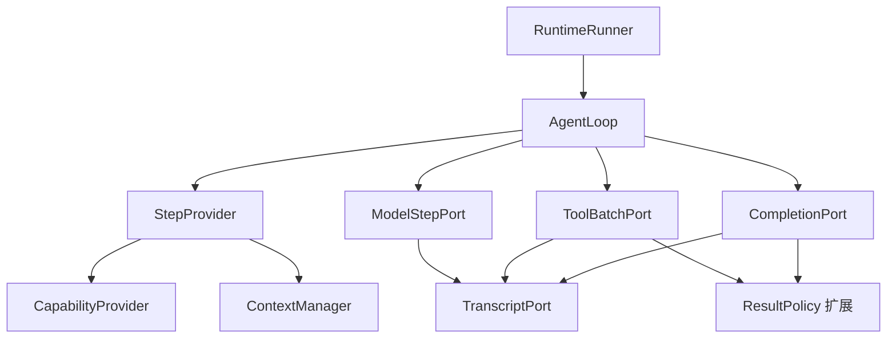

**Agent Runtime 集成层设计 v2：独立通用库与内部适配**

本版取代 v1 的代码复用、开发基线和首个交付前提。新的实施方式是：在获准的外部环境独立开发通用 Runtime，再将固定版本引入公司内部，由内部开发者或编程模型完成业务适配与集成验证。

本文件是开发与接入设计，包含内部适配规划，不直接作为可公开发布的项目文档。公共项目使用的需求、资料和发布范围仍按已确认的允许范围处理；本次更新不发布源码、不复制公司实现，也不宣称已完成运行时开发或集成测试。

**1. 本次决策变更**

| 项目 | v1 前提 | v2 决策 |
| --- | --- | --- |
| 代码起点 | 基于 R1–R9，优先复用已有核心 | 独立通用仓库自行实现，不依赖公司代码 |
| R1–R9 的用途 | 作为直接开发基线 | 留在公司内作为问题、行为和修复参考，不默认已完整验证 |
| 公司内接入基线 | 当前重构版本 | 最近实际验证过的稳定版本；必要缺陷修复单独移植与验证 |
| 对外入口 | 包含业务 Session、重新生成、Widget 等类型 | 通用请求、执行入口、预算、记录目标与取消 |
| 外部首个交付 | 真实业务工具、数据库与 SSE 链路 | 可安装包、参考实现、合成场景和契约测试 |
| 公司内工作 | 在新结构上继续迁移 | 实现端口及业务政策，执行真实系统验收 |
| 完成标准 | 核心提取与业务链路混合判断 | 外部库完成和公司内接入完成分别验收 |
| 开源 | 未单独区分 | 独立开发、包分发和公开发布分别决策 |

保留的设计：四个核心端口、状态单一写入所有者、每轮一致快照、工具记录屏障、中立事件、严格完成协议、显式关闭传播。变化的是源码来源、公共 API 边界及交付顺序。

**2. 外部通用库与内部代码的边界**

| 能力 | 通用库实现 | 公司内部实现 |
| --- | --- | --- |
| 执行控制 | 模型/工具推进、预算、停止、关闭、协议校验 | 业务入口转换和错误码映射 |
| 能力准备 | 能力快照、Fixed 提供者、可组合选择链、执行绑定接口 | 真实目录、权限及产品路由政策 |
| 上下文 | 贡献者接口、确定性合并、预算、工具消息配对、可替换压缩器 | 业务注入来源、优先级和具体内容 |
| 模型步骤 | 规范化、请求级重试与恢复接口、任务管理 | 现有模型网关、模型选择及特殊恢复策略 |
| 工具步骤 | 校验、调用记录屏障、分派、结果提交、控制汇总 | 业务工具协议、鉴权与结果处理 |
| 文本完成 | 最终文本提交、可替换完成政策 | 子任务/工作流继续等业务规则 |
| 记录 | 记录器接口、内存实现、消息身份与回执 | 数据库、软删除、重新生成和会话映射 |
| 观测 | 只读观察者接口、基础事件与耗时 | 企业观测后端及字段政策 |
| 验证 | 参考适配器、契约测试、故障注入 | 真实数据库、业务副作用和前端回归 |

业务类型不进入通用库。外部代码不导入公司包、不调用旧 orchestrator、不要求访问公司注册中心、数据库或日志。

内部实现依赖公共接口。需要改变业务行为时优先修改内部适配器；如果必须修改 Runtime 源码，可以维护内部分支，但该分支的升级与后续对外同步分别受内部维护规则和允许范围约束。

**3. 运行结构与责任分配**



箭头表示依赖。RuntimeRunner 管理本次运行资源、初始记录和最终化；AgentLoop 唯一拥有循环。默认管线提供可直接使用的组合，宿主可以替换端口实现。

| 模块 | 责任 | 核心不需要了解的内容 |
| --- | --- | --- |
| 能力模块 | 选择能力、加载描述、绑定执行器、发布版本 | 能力属于哪一种产品或目录 |
| 上下文模块 | 构建模型可见视图、注入、预算、压缩 | 内容来自哪张表或哪个业务系统 |
| 模型步骤 | 完成一次有效模型推理，产生中立事件 | 供应商 SDK 的响应类型 |
| 工具批次 | 先记录后执行，提交结果，返回通用控制指令 | HTTP 协议、鉴权、UI 和业务副作用 |
| 文本完成 | 提交文本后执行完成政策 | 具体工作流或子任务语义 |
| 记录器 | 消息身份、提交回执、已提交历史 | 数据库和持久化 schema |
| AgentLoop | 根据结果推进、终止或等待 | 路由名称、工具特殊名称、业务状态字段 |

**4. 责任链、流水线和扩展点**

- 能力选择采用条件责任链：只有明确 `NoMatch` 才进入下一个提供者，`Matched` 结束选择。`Degraded`、配置错误和权限拒绝不能自动当作不匹配。
- 上下文采用累积流水线：收集、合并、预算、压缩、配对修复按依赖顺序执行。
- 调用记录、结果提交、业务状态应用和运行终态是必需阶段，顺序固定并显式等待。
- 观测采用可选装饰器或只读监听器，故障隔离，不改变执行结果，不重复调用被包装的操作。

不同输入/输出职责使用不同接口，不建立可以任意读写整个运行上下文、随意跳转的通用插件链。工具重试与模型重试由各自政策管理，不给整条业务管线套通用重试器。

**5. 状态所有权与通用值对象**

| 状态 | 唯一写入者 | 对外视图 |
| --- | --- | --- |
| 步骤编号、模型轮次、执行阶段 | AgentLoop | `StepIdentity`、执行事件 |
| 当前能力与版本 | 本次运行的能力实例 | `CapabilitySnapshot` |
| 已提交消息及 ID | TranscriptPort 实现 | `TranscriptSnapshot`、提交回执 |
| 压缩摘要和模型视图 | ContextManager | `PreparedContext` |
| 应用状态和记录目标 | 应用状态所有者 | `ApplicationSnapshot`、`RecordTarget` |
| 模型尝试、后台等待及执行任务 | 运行资源作用域与创建任务的端口 | 明确的关闭和取消接口 |

应用快照是应用定义的只读视图，不是所有节点共享的可变字典。各政策只接收其需要的类型化部分。状态变更通过所属模块的命令提交，下一步再读取新快照。

上下文压缩处理模型视图，不删除原始对话事实。摘要如需持久化，写入独立投影存储接口。默认内存实现遵守同一事实/投影区分。

配置、连接池和无状态服务可以共享；当前用户、模型选择、输出回调、激活能力及任务引用属于本次运行。新的通用库不设置全局“当前运行”对象。

**6. 公共接口草案**

以下代码是设计接口，不是完整可执行实现。未展开的值对象在公共契约模块中统一定义；同一种事件和枚举只有一个权威定义。公共类型不使用旧业务 schema 的重导出。

```python
from __future__ import annotations

from dataclasses import dataclass
from enum import Enum


class Flow(Enum):
    CONTINUE = "continue"
    FINISH = "finish"
    WAIT = "wait"


@dataclass(frozen=True)
class RecordTarget:
    value: str


@dataclass(frozen=True)
class StepIdentity:
    run_id: str
    step_no: int
    model_round: int


@dataclass(frozen=True)
class FlowDecision:
    flow: Flow
    reason: str | None = None
    pending_ref: PendingRef | None = None


@dataclass(frozen=True)
class CapabilitySnapshot:
    version: str
    tools: tuple[ToolSpec, ...]
    binding_ref: BindingSetRef
    contributions: tuple[ContextContribution, ...]
    policy_ref: CapabilityPolicyRef


@dataclass(frozen=True)
class PreparedStep:
    identity: StepIdentity
    record_target: RecordTarget
    request: ModelRequest
    capabilities: CapabilitySnapshot
    context_version: ContextVersion


@dataclass(frozen=True)
class ToolBatchCommand:
    identity: StepIdentity
    record_target: RecordTarget
    calls: tuple[ToolCall, ...]
    capabilities: CapabilitySnapshot
    assistant_text: str | None
    reasoning: str | None
    previous_receipt: BatchReceipt | None = None


@dataclass(frozen=True)
class CompletionCommand:
    step: PreparedStep
    result: ModelResult
```

| 值对象 | 必须表达的内容 |
| --- | --- |
| `ModelRequest` | 消息、工具定义、模型配置、tool choice、本请求恢复预算 |
| `ModelResult` | 最终文本、可选 reasoning、工具调用、使用量；没有业务对象 |
| `ToolSpec` | 模型可见名称、描述、参数 schema |
| `ToolCall` | 调用 ID、工具名称、参数 |
| `BindingSetRef` | 本轮执行绑定集合的版本引用，不包含可序列化凭据 |
| `RecordTarget` | 应用提供的记录目标标识；Runtime 不解析业务含义 |
| `ContextVersion` | 本步读取的历史、能力与应用快照版本 |
| `MessageReceipt` | 有效消息 ID、所属运行/步骤、记录目标 |
| `BatchReceipt` | 已提交调用集合及关联消息，或明确的无需记录结果 |
| `PendingRef` | 宿主可解释的等待引用；不等于库自动持久化的检查点 |

`request.tools` 与本步能力快照保持一致。集合使用不可变值或受控副本；`frozen=True` 不自动保护内部可变对象。参数鉴权在工具适配器/应用政策中执行，不因具有 RecordTarget 或绑定引用就自动授权。

核心依赖四个端口：

```python
from __future__ import annotations

from dataclasses import dataclass
from typing import Protocol, TypeVar


T_co = TypeVar("T_co", covariant=True)


class ManagedEventStream(Protocol[T_co]):
    def __aiter__(self) -> ManagedEventStream[T_co]: ...
    async def __anext__(self) -> T_co: ...
    async def aclose(self) -> None: ...


class StepProvider(Protocol):
    async def prepare(self, identity: StepIdentity) -> PreparedStep: ...


class ModelStepPort(Protocol):
    def stream(self, step: PreparedStep) -> ManagedEventStream[ModelStepEvent]: ...


class ToolBatchPort(Protocol):
    def execute(self, command: ToolBatchCommand) -> ManagedEventStream[ToolBatchEvent]: ...


class CompletionPort(Protocol):
    def complete(self, command: CompletionCommand) -> ManagedEventStream[CompletionEvent]: ...


@dataclass(frozen=True)
class ExecutionPorts:
    steps: StepProvider
    model: ModelStepPort
    tools: ToolBatchPort
    completion: CompletionPort
```

每个步骤流正常结束时，恰好一个对应的完成事件且为最后一项。`ModelCompleted` 携带有效 ModelResult；`ToolBatchCompleted` 与 `CompletionCompleted` 携带 FlowDecision。错误、停止和取消不发布正常完成事件。

公共入口也使用通用类型：

```python
from __future__ import annotations

from dataclasses import dataclass
from typing import Protocol


@dataclass(frozen=True)
class RunRequest:
    run_id: str
    input_items: tuple[Message, ...]
    record_target: RecordTarget
    entry: ExecutionEntry
    limits: ExecutionLimits


class Runtime(Protocol):
    def run(
        self, request: RunRequest, control: RunControl,
    ) -> ManagedEventStream[RuntimeEvent]: ...
```

`RunControl` 提供取消来源与期限，不包含业务状态或服务定位器。宿主在调用前完成身份和入口校验。运行器在初始记录成功后才开始模型或工具；核心完成后，必需最终化成功才发布对外成功终态。

**7. 默认能力与上下文实现**

独立库必须具有可使用的默认实现，不能只交付 Protocol。

| 默认组件 | 第一版行为 |
| --- | --- |
| `FixedCapabilityProvider` | 返回配置的能力快照，不调用意图路由；空集合不从未知状态继承额外工具 |
| `ResolverChain` | 组合提供者，只在 NoMatch 时继续；降级处理显式配置 |
| `CapabilitySession` | 每次运行独立保存激活集合，变更后发布新版本 |
| `ContextManager` | 历史投影、贡献合并、预算与压缩协调 |
| `ContextContributor` | 返回内容、来源、作用域、优先级与去重键 |
| `TokenBudgetPolicy` | 计算提示词和工具 schema 预算，支持注入具体模型的估算器 |
| `CompressionStrategy` | 可替换裁剪/摘要策略；默认确定性裁剪按完整工具调用组处理 |
| `DefaultStepProvider` | 组合以上组件及记录器/应用视图，生成一致的 PreparedStep |

摘要器通过模型接口注入；压缩与工具配对修复由上下文模块负责，底层模型适配器不实现这些算法。估算器的精度及余量必须明确，近似 token 数不是供应商接受请求的保证。

每轮准备重新读取已提交历史、当前记录目标和能力版本。注入来源可按作用域缓存，重新构建请求不意味着每轮都访问外部数据源或重新意图路由。

状态应用先完成，再发布下一模型步骤。若多份快照的版本不一致，重新读取快照；不重放刚刚执行的工具。跨模块提交失败时停止推进、使受影响缓存失效，不宣称具有跨服务原子事务。

一个工具批次绑定到模型决策时的能力版本。批次中激活的新工具只能影响下一轮，不能放行本批次原本没有暴露的调用。

**8. 循环状态与执行入口**

| 入口 | 行为 |
| --- | --- |
| `ModelEntry` | 准备输入并调用模型 |
| `ToolBatchEntry` | 执行已选定但尚未执行的调用，再按结果和入口约定继续或结束 |
| `CompletedEntry` | 不调用模型或工具，仍完成运行生命周期 |

核心负责：检查停止与预算 → 分配步骤身份 → 准备输入 → 消费模型 → 调用工具或文本完成端口 → 按 FlowDecision 推进。

核心将全部工具调用交给工具端口，不识别特殊工具名称。正常文本经过 CompletionPort 提交，核心不直接保存历史或操作应用状态。

步骤编号和模型轮次分开。初始工具步骤不消耗模型轮次；请求重试和空响应恢复不增加模型轮次。恢复入口显式提供已消耗预算；新运行是否继续旧预算由宿主决定。

业务终止/等待决定优先于入口的默认后续动作。v0.1 的 WAIT 表示当前步骤已结束、需要宿主接手；提供等待引用及已完成调用信息，但不自带持久化检查点或自动恢复系统。执行前审批由宿主准备阶段决定哪些调用可以进入执行入口。

核心必须消费并验证步骤流正常耗尽后才执行下一阶段，不能遇到第一个完成事件就提前返回并跳过尾随事件校验。

**9. 模型、工具与文本完成管线**

模型步骤的底层适配器只处理公开模型协议和响应归一化。模型管线负责任务、尝试、流式输出记录及恢复协调。

- 空文本且没有工具调用的结果不产生 ModelCompleted；单独 reasoning 不算有效最终结果。
- 恢复使用本请求的工具快照、tool choice 和预算；需要压缩或换模型后的预算调整时，调用上下文模块。
- 已对外输出的内容必须遵守明确的覆盖或保留政策；默认不拼接不同失败尝试的部分答案。
- 可选的特殊响应解析属于归一化扩展，不写入循环。
- 模型管线不重放已执行工具。provider task 由创建者取消并等待，清空引用不等于释放任务。

工具批次内固定执行以下阶段：

| 阶段 | 契约 |
| --- | --- |
| 校验批次 | 按固定快照检查全部调用、参数与绑定；校验失败不执行 |
| 记录调用 | 提交需要记录的调用集合；成功后才允许第一项外部调用 |
| 执行 | 默认顺序调用；具体错误处理由明确政策决定 |
| 提交结果 | 应用结果政策，提交下一次模型请求依赖的记录和状态 |
| 汇总控制 | 返回唯一 ToolBatchCompleted |

默认记录全部模型可见函数调用，并保持调用/结果配对。宿主如有内部上下文动作，必须提供显式记录与投影政策，同时保证发给模型的完整消息关系合法，不能任意遗漏一个工具结果。

工具执行顺序、普通错误是否转为模型可见结果、多个业务结果的终止优先级，由可替换的批次/结果政策明确规定。默认实现顺序执行并在批次结束汇总；不默认启用并行执行。协议错误、关键记录失败和取消中止运行。

应用结果政策负责副作用的先后顺序，核心只接收 CONTINUE、FINISH 或 WAIT。多个副作用可以同时存在，不能用首次命中即结束的结果处理链。

外部操作成功但本地结果提交失败时，保留调用身份并停止推进。重试需要工具自身的幂等或核对机制，Runtime 不保证跨系统 exactly-once。

CompletionPort 先提交最终文本和 reasoning，再调用完成政策。默认返回 FINISH；宿主政策可以在完成业务状态更新后返回 CONTINUE。文本提交失败时不得执行后续完成副作用。

**10. 记录、事件和观测**

`MemoryTranscript` 是正式的参考记录器，实现与数据库记录器相同的行为契约；它不宣称跨进程持久化。

- 消息身份由运行、步骤和目标共同确定。同一步骤同一目标的增量与最终内容可以复用消息；新步骤或目标变化必须新建。
- 调用记录回执必须指向真实存在的消息；更新不存在的 ID 应失败，测试替身也遵守此规则。
- 记录器按运行建立，读写时显式传 RecordTarget，不固定绑定初始目标。
- 模型上下文读取遵守宿主给出的目标范围，不能把所有目标记录自动合并。
- 持久化实现先提交存储，再发布内存已提交视图；失败后不能继续使用半更新视图。
- 同一逻辑操作的重复记录使用显式幂等身份；调用者提供的 previous_receipt 必须被记录器核验。

运行事件携带 run/step/call 身份及消息回执。文本与工具事件是中立协议；应用扩展事件的业务含义由宿主解释，核心只转发。内部步骤完成与整个运行完成是不同事件。

| 处理 | 失败语义 |
| --- | --- |
| 必需消息和运行记录 | 显式等待；失败影响执行结果 |
| 下一步依赖的应用变更 | 完成后才能推进 |
| 观测 | 有界等待或队列；故障隔离，不修改控制结果 |
| HTTP/SSE 等输出投影 | 不执行数据库写入，不决定循环是否继续 |

可选观察者不调用下一步、不修改共享状态、不重放 handler。需要可靠异步交付的业务消息由宿主实现相应机制，不能依赖 best-effort 观测队列。

**11. 取消、关闭和资源生命周期**

每次运行独立持有任务与取消状态。端口返回声明了 aclose 的 ManagedEventStream，异步生成器可以直接实现该契约。

入口消费器、运行器、核心、模型/工具端口和底层流按所有权使用显式关闭。任何提前关闭路径都应取消并等待相关任务，不依赖垃圾回收。

停止检查覆盖：模型无事件等待、重试退避、工具等待和阶段边界。用户停止、宿主取消及消费者断开是不同原因，库不把断开自动解释成用户停止。无法立即取消的外部工作由适配器声明并由宿主追踪。

最终化分别保护部分输出处理、运行记录和资源释放。记录失败不能阻止资源清理；关键提交未完成时不发布成功。保护性等待有界；消费者已经关闭时不尝试继续 yield 最终事件。

核心只管理本次运行。跨 worker 互斥、进程恢复和多目标存储事务属于宿主或可选实现，v0.1 不以全局内存锁冒充这些保证。

**12. 装配、包边界与交付物**

默认装配创建本次运行的记录器、能力实例、上下文实例和资源作用域。全局只持有配置和可安全共享的服务。装配根可以持有依赖集合，但不把它传给所有模块作为服务定位器。

建议代码归属如下；包名为开发占位，发布前另行确认名称。

| 路径 | 内容 |
| --- | --- |
| `agent_runtime/contracts.py` | 独立定义的请求、结果、事件和值对象 |
| `agent_runtime/ports.py` | 四个核心端口及记录、应用政策扩展接口 |
| `agent_runtime/core.py` | 新实现的最小状态机 |
| `agent_runtime/runner.py` | 通用生命周期与装配调用 |
| `agent_runtime/capabilities/` | Fixed、责任链、能力会话与快照 |
| `agent_runtime/context/` | 贡献合并、预算、压缩与投影 |
| `agent_runtime/pipelines/` | 默认模型、工具和文本完成管线 |
| `agent_runtime/recording.py` | 记录契约及内存实现 |
| `agent_runtime/observability.py` | 只读观察者及装饰器 |
| `agent_runtime/testing/` | 脚本化模型、受控工具、故障注入及契约测试支持 |
| `examples/` | 合成业务示例与参考模型适配器用法 |
| `docs/agent-runtime/adapter-guide.md` | 内部适配说明，不包含公司业务材料 |

默认管线承接复杂的通用顺序，内部适配可以优先实现较低层的模型、工具、记录及结果政策接口；不强迫内部 AI 重新实现整条工具批次管线。必须完全接管语义时，才替换整个 ToolBatchPort，并运行完整契约测试。

外部交付包含：可安装 wheel/source distribution、锁定版本的参考环境、稳定导入路径、接口说明、参考实现、合成场景、契约测试及升级说明。公共核心不强制依赖某个框架、数据库或网络服务；模型供应商参考适配器使用可选依赖。

内部项目固定包版本与获取来源，避免直接跟随开发分支。公开发布不是分发包给公司内部使用的技术前提；本设计不执行发布操作。

**13. 参考实现与契约测试套件**

外部必须交付可运行实现和可重复测试，不能只提供接口骨架。

| 参考组件 | 用途 |
| --- | --- |
| `ScriptedModel` | 确定性产生文本、工具调用、空结果、错误及静默等待 |
| 标准模型 API 参考适配器 | 验证真实模型调用路径，作为可选依赖；CI 不要求私有凭据 |
| `MemoryTranscript` | 校验消息存在性、身份、目标、重复提交和写入失败 |
| 受控工具与 Invoker | 记录真实调用次数，支持进度、失败、阻塞和取消 |
| 合成能力提供者 | 发布工具版本变化，验证下一轮重建 |
| 合成结果政策 | 模拟目标变化、上下文更新、继续、结束与等待 |
| 契约测试 Harness | 将同一套测试绑定到参考实现或公司内适配器 |

契约测试应验证行为，而不是要求实现继承某个具体类：

| 契约场景 | 必须检查 |
| --- | --- |
| 正常文本 | 有效消息回执、最终文本及成功终态 |
| 工具后继续 | 调用、结果提交后才发生下一模型请求 |
| 记录失败 | 调用计数为零；不存在未提交历史追加 |
| 终止或等待 | 没有额外模型调用；等待引用及已执行信息正确 |
| 能力版本变化 | 当前批次固定旧版本；下一请求使用新版本 |
| 消息身份 | 同步同目标复用，新步骤/新目标隔离，重复提交不重复创建 |
| 空响应恢复 | 请求级 tools、tool choice、预算保持，恢复仍空不产生 ModelCompleted |
| 完成协议错误 | 缺失、重复或尾随完成事件被检测，不继续执行 |
| 停止/关闭 | provider、事件等待、退避和工具任务被实际取消并等待 |
| 预算 | 初始工具不占模型轮次；重试不额外占轮次 |
| 状态隔离 | 两个运行互不污染模型、回调、目标和能力 |
| 观测失败 | 不重放工具，不改变正确的业务结果 |

测试替身必须拒绝非法状态，例如更新不存在的消息。取消测试检查任务确实退出及资源已释放，不能只断言某个清理回调被调用。对模型和工具调用计数设置非空断言，避免提前失败导致假通过。

应用适配器测试保留真实的待验证适配器，只替换其受控外部依赖；不能把需要验证的记录屏障或状态应用函数直接 mock 掉。外部默认使用合成数据，真实业务轨迹及私有测试在公司内验证。

**14. 外部 v0.1 的完成标准**

v0.1 交付一个单 Agent、默认顺序工具执行的完整 Runtime：四端口、默认管线、Fixed 能力、可组合选择链、上下文处理、记录与观测扩展、取消关闭和测试工具。

首批场景全部使用通用合成业务：

1. 模型调用普通工具后生成文本。
2. 工具更新上下文或能力，下一次请求得到新快照。
3. 工具改变记录目标并终止，消息关联正确且不再调用模型。
4. 记录失败、空结果恢复、无 token 停止及流提前关闭。

通过可安装包和公开接口执行这些场景，不从测试代码绕过默认装配直接操作核心私有状态。标准模型 API 的参考适配器可做独立实测，但不把有外部凭据的测试设为基础套件必需条件。

v0.1 不承诺通用工作流图、多 Agent 调度、持久化检查点、跨 worker 执行锁、数据库事务协调或任意业务插件自动兼容。接口为宿主扩展保留明确位置，不提前实现整个企业 Agent 平台。

**15. 公司内部接入规划（不属于公共库实现）**

内部接入从最近实际验证过的稳定版本开始；如果该版本在 R1–R9 之前，可以使用它。已确认的必要缺陷修复以最小变更移植和验证；R1–R9 不作为外部源码来源，也不因曾报告单测通过而默认完成集成验证。

| 内部适配 | 具体责任 | 外部 Runtime 看到的结果 |
| --- | --- | --- |
| 业务入口适配 | 普通聊天、retry、pending、Widget 操作的身份与输入准备 | RunRequest 与 Model/ToolBatch/Completed 入口 |
| 能力适配 | App/Skill 目录、权限、external_status、工具作用域 | CapabilitySnapshot |
| 上下文适配 | AAP、Widget/View、文件、记忆和入口 Prompt | ContextContribution / PreparedContext |
| 模型适配 | 现有网关、企业配置、特殊恢复与归一化 | 标准模型事件和 ModelResult |
| 工具适配 | AINA、脚本、鉴权、流式业务工具 | 调用结果与进度事件 |
| 结果政策 | Session、Canvas、confirmation、Skill 继续规则 | 已提交状态变更和 FlowDecision |
| 记录适配 | DB 消息、会话归属、软删除、元数据与终态 | 消息/批次提交回执 |
| 传输适配 | 当前 SSE 协议、前端消息 ID 与连接语义 | 仅负责投影通用运行事件 |

RecordTarget 在内部映射为现有会话引用，RunRequest 不包含专用 UI 类型。业务继续策略通过政策返回通用控制结果，不向核心添加 `if widget` 或 `if load_skill`。

内部适配必须保留真实业务协议，例如：retry 的原始输入和 file_ids；assistant 调用与结果的目标关系；Session/Widget 事件处理顺序；副作用后失败不得盲目重放；用户停止和断开区别。具体细节在公司内按最新源码核对，公共库不编码这些规则。

公司内 AI 的交付任务应逐项给出：需要实现的接口、参考实现、允许访问的内部服务、必须通过的契约用例及业务回归。优先复用公共默认管线，避免它再次编写一套循环和取消逻辑。

最早接入可选择 Fixed 的工具批次路径：记录调用 → 真实 AINA 执行 → Session/Canvas 处理 → 终止。外部库可以先独立完成；一旦能在公司内测试，就尽早反馈接口问题，不必等所有公共扩展完成。

接入时按新运行选择旧或新实现，并固定该次运行使用的版本。同一次真实写操作不做新旧双执行；回滚影响后续运行，不撤销已发生的外部副作用。

**16. 分别定义完成与后续动作**

| 阶段 | 完成依据 | 不能据此宣称 |
| --- | --- | --- |
| 外部库完成 | 包可安装、参考实现可运行、通用契约测试与故障测试通过 | 公司真实系统已经兼容 |
| 内部适配完成 | 实际适配器通过契约测试及业务回归，消息、UI、权限和副作用正确 | 所有生产场景已完成灰度 |
| 生产切换完成 | 目标入口实际运行、监控与回滚验证完成 | 外部公共版本自动包含内部修改 |

依赖层面的独立验收：公共包不导入公司模块；参考场景无公司网络也能运行；内部适配器依赖公共接口；切换压缩策略、记录器或观察者不修改 AgentLoop。

下一步交付是独立仓库的 v0.1：先以公共契约、默认装配和参考实现跑通首批合成场景，再补齐失败路径和可供内部 AI 使用的适配说明。外部开发不以公司源码导出或 R1–R9 完整验证为前置条件。

本次文档更新只确定设计与交付边界。实际接口实现、包名、兼容版本及测试结果在开发时记录，不以文档示例替代实现验收。
